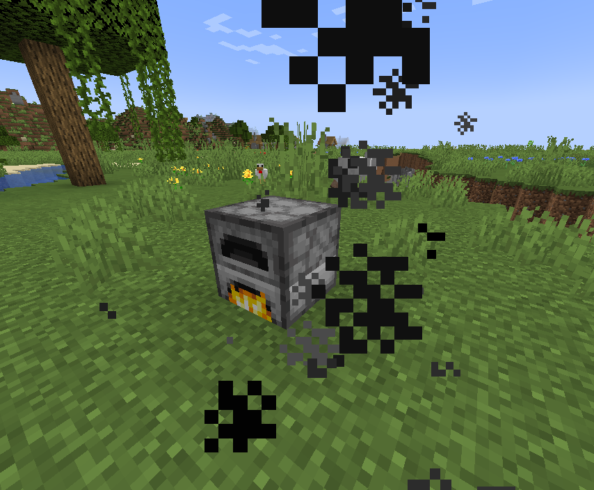
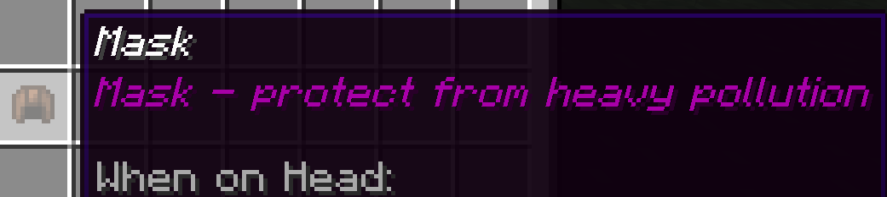

## **Table of contents**
**[Introduction](#introduction)**

**[1 Pollution](#pollution)** 
  * [1.1. Global Pollution](#global-pollution)
  * [1.2. Local Pollution](#local-pollution)
  * [1.3. Pollution Indicator](#pollution-bar)
  
  * [1.4. Player Influence on pollution](#player-influence)
    - [1.4.1. Increase Pollution](#increase-pollution) 
    - [1.4.2. decrease Pollution](#decrease-pollution) 

  * [1.5. Pollution Effects](#pollution-effects)
    - [1.5.1. Acid Rain](#acid-rain) 
    - [1.5.2. Pollution Damage](#pollution-damage)
    - [1.5.3. No drop from crops](#no-drop-form-crops)
    - [1.5.4. Dead fish in reservoirs](#dead-fish)
    - [1.5.5. Mask](#mask) 
  
  
**[2 Photovoltaic Installation](#solar-panel-h)**
  * [2.1. Solar Panel](#solar-panel) 
  * [2.2. Solar Panel Base](#solar-panel-base)
  * [3.3. Cable](#cable)
  
**[3 Regions](#regions)**
  * [3.1. Use of world map](#word-map) 
  * [3.2. Data from geo-location](#geo-location)

**[4 Heat Islands](#heat-islands)**

**[5 Commands](#commands)**
  * [5.1. /mask](#c-mask) 
  * [5.2. /solar](#c-solar-panel)
  * [5.3. /solarbase](#c-solar-panel-base)
  * [5.4. /cable](#c-cable)   
  * [5.5. /realTp](#c-realTp)
  * [5.6. /where](#c-where)
  * [5.7. /details](#c-details)
  * [5.8. /localpollution](#c-localpollution)
  
**[6 Craftings](#craftings)**
  * [6.1. Mask](#cr-mask) 
  * [6.2. Photovoltaic Panel](#cr-solar-panel)
  * [6.3. Photovoltaic Panel Base](#cr-solar-panel-base)
  * [6.4. Cable](#cr-cable)   

**[7 Texture Pack](#texture-pack)**

**[8 Configuration File](#configuration-file)**

**[9 Installation](#instalation)**

**[10 Miscellaneous](#misc)**

 

## **GigaBlockIncorporated - Ecocraft**
The main purpose of this plugin is to broaden the general knowledge on pollution and its negative impacts. We decided to show how pollution affects certain areas of the word so this plugin is mended to be played on a map that resembles earth such as maps found [here](https://earth.motfe.net/map-downloads/). In plugin showcase we decided to use maps in scale 1:1000. We also used the open source [api](https://aqicn.org/) to retrieve pollution information from different parts of the world.

## **Pollution**

This feature is supposed to show how pollution affects everything around us, and how strongly we affect the environment and the other way. The core principle underlying pollution are [regions](#regions). Every region has certain attributes. In this section, we will focus on [global](#global-pollution) and [local](#local-pollution) pollution.The pollution accounted for is **overallpollution** - the sum of local and global pollution. There are three levels of pollution - low pollution (has no negative effects), moderate pollution (has certain negative effects) and high pollution (has revolutionary effects). Look at [this](#pollution-effects) for further information about pollution effects.

## **Global Pollution**

Global Pollution is fetched from API, and it cannot be changed by player - it's the base pollution level for given [region](#regions). Global pollution value is the value from the station situated in nearest [regions](#regions) centre so its actual value may be offset or does not match with actual Geo location.

Local Pollution is calculated on certain events - when player plants a tree, when player changes a region, and when furnace is burning. Local pollution can be changed by the player it can be [increased](#increase-pollution) and [decreased](#decrease-pollution) by certain player actions. Players should control pollution level because it can affect them. It can by negative thus it can lover pollution level in region below base value.

## **Pollution Indicator**
It is the main (other way -> [click](#c-details)) way of indication how polluted is current [region](#regions). Pollution indicator takes form of status bar with pollution number in center top of the screen.

There are three main indications:

* **Low Pollution** 
  

* **Medium Pollution** 

  

* **High Pollution** 

  

Look at [this](#pollution-effects) for further information about pollution effects.

## **Player Influence on pollution**

By performing certain action player can decrease or increase level of local pollution. 

## **Increase Pollution**
Player can increase local pollution level by burning fossil fuels in furnaces or by braking saplings. When fossil fuel is burnt in the furnace cloud of pollution appears. When burning stops pollution level does not decrease. 

## **Decrease Pollution**
You can decrease pollution level by either planting sapling or placing [solar panels](#solar-panel).

There are no positive pollution effects. The upper bound of low, medium and high pollution can be changed in [configuration file](#configuration-file). When pollution in low there are no negative effects, when pollution is medium there are some negative effects ([acid rain](#acid-rain)) and when pollution is high there are plenty of negative effects ([acid rain](#acid-rain), [pollution damage](#pollution-damage), [no drop from crops](#no-drop-form-crops) and [dead fish in reservoirs](#dead-fish)).

## **Acid Rain**
This effect appears when pollution level is medium or higher.Acid rain takes place of normal rain.It destroys leafs,grass, and crops. It also damages living creatures including player. Damage vary from level. Damage values and pollution boundaries can be set in [configuration file]("#configuration-file).

## **Pollution Damage**
This effect appears only when pollution level is high. When player is in highly polluted [region](#region) it is harming him constantly in time intervals. Damage value and interval can be set in [configuration file](#configuration-file).

## **No drop from crops**
This effect appears only when pollution level is high. When player is in highly polluted [region](#region) the is a 50% chance that crops would not drop an item.

## **Dead fish in reservoirs**
This effect appears only when pollution level is high. When player is in highly polluted [region](#region) the fishes that player caught will be dead. When player eat dead fish he will be given negative effects. Same thing happen when player cook dead fish and eat it.

## **Mask**
This is the countermeasure to [pollution damage](#pollution-damage). When player wears a mask he would not take damage even when in highly polluted region.

## **Photovoltaic installation**
Photovoltaic installation is an alternative way of smelting in furnaces, without producing any pollution at all. To make photovoltaic installation you have to have [cable](#cable), [solar panel base](#solar-panel-base) and [solar panel](#solar-panel). [solar panel](#solar-panel) must be placed on [solar panel base](#solar-panel-base) and when the criteria are fulfilled (there is a day, solar panel is not obscured) installation will be producing power. To connect furnaces use [cable](#cable).

## **Solar panel**
It is the source of energy in [photovoltaic installation](#solar-panel-h). To obtain this block use either [. /solar](#c-solar) command or use [crafting](#cr-solar-panel) recipe.
 

## **Solar panel base**
This block is required to transport energy from photovoltaic panel to cable. To obtain this block use either [./solarbase](#c-solar-panel-base) command od use [crafting](#cr-solar-panel-base) recipe. 
 

## **Cable**
This block is required to transport energy from photovoltaic panel base to furnace. To obtain this block use either [./cable](#c-cable) command od use [crafting](#cr-cable) recipe. 
 

## **Regions**
Region is base on which pollution system is build. In [configuration file](#configuration-file) you have to input world dimensions (width and height) after that you have to enter number of regions that the world will be deviled - setting the default resolution (higher the number of region the better resolution).

## **Use of world map**
Our plugin use word map influence to more immersion. Thanks to that player can play for eg. in their home country and experience how polluted is this area.

## **Data from geo-location**
The reason behind entering word dimensions is that it enable us to calculate in-game coordinates into real life coordinates and thanks to that we can implement [global pollution](#global-pollution) (api that we use require coordinates) and [/realTp](#c-realTp) command.

## **Heat Islands**

Heat islands are urbanized areas that experience higher temperatures 
than outlying areas. This is caused by structures such as buildings, 
roads and other infrastructure absorb energy from sun an 
then re-emit it in form of heat. 

In our visualization we tried to replicate that phenomena, but also keep the game playable.
In order to achieve that goal, we categorized some blocks as heat absorbent. (for example concrete). 
If the player stands in the heat for an extended period of time on such blocks, 
he starts to take damage. To avoid taking damage player can wear leather boots, 
action which decreases her/his armor points.
 

## **Commands**
Those commands can only be used by admin except [./where](#where) and [./details](#details).

## **/mask**
Gives player [mask](#mask)

## **/solar**
Gives player [solar panel](#solar-panel)

## **/solarbase**
Gives player [solar panel base](#solar-panel-base)

## **/cable**
Gives player [cable](#cable)

## **/realTp**
Gives player [cable](#cable)
This command teleports player to give real word coordinates.
 
Format of the command is `/realTp <latitude> <longitude> <y-value>`.

## **/where**
This command displays on chat current region location. Location is fetched from center of the region.

## **/details**
Shows detailed pollution values of the current regions on the right of the screen. 

## **/localpollution**
Sets vale of local pollution to the given value.
 
Format of the command is `/localpollution <value>`.

## **Craftings**

## **Mask**
Crafting of the [mask](#mask)
 

## **Solar Panel**
Crafting of the [solar panel](#solar-panel)
 

## **Solar Panel Base**
Crafting of the [solar panel base](#solar-panel-base)
 

## **Cable**
Crafting of the [cable](#cable)
 

## **Texture Pack**

The texture pack is mostly based on notebooks. This particular block has the most states. This property us to make the custom blocks used in our plugin, such as [cable](#cable),[Solar panel](#solar-panel) and [Solar panel base](#solar-panel-base). It also introduces the fiery screen, visible during the [heat island](#heat-islands) phenomenon and [face mask](#face-mask), which can be worn by the player.

## **Configuration File**
Configuration file (config. yml) is located in the plugin folder (EcoCraft) inside the plugin folder located in server files. 
 
In configuration file you declare the base values required for plugin to work.
 

The most important one are world *dimensions*, *number of regions*

 

 and *api token*
  

  
  width and height of the map, if they are wrong coordinates will be calculated wrong, thus breaking pollution system and without API token data will not be fetched from API.
   

   Next values that can be changed are *pollution boundaries* and *acid rain damage* those values are optional and set do default vales.
   
  
 

 

 Also *showcase mode* is optional. This mode gives admin reserved commands (implemented in [commands](#commands) to everyone.
 

## **Installation**
First, you have to download [earth map](https://earth.motfe.net/map-downloads/) and replace your *world* folder with it. To install the plugin you have to build a jar file inside the plugin folder located in your server file. Next, you have to make changes to [configuration file](#configuration-file) (input width, height, API token and number of regions). Lastly you have to install resource pack in your miecraft client [link](https://github.com/Ecocraft-2022/GigaBlockIncorporated/raw/main/src/main/resources/giga-resourcepackv4.zip).

## **Miscellaneous**

>List of absorbent blocks
>---------
>*  BLACK_CONCRETE
>*  GRAY_CONCRETE
>*  BROWN_CONCRETE
>*  BLACK_CONCRETE_POWDER
>*  GRAY_CONCRETE_POWDER
>*  BROWN_CONCRETE_POWDER
>*  BLACK_WOOL
>*  GRAY_WOOL
>*  BROWN_WOOL
>*  IRON_BLOCK
